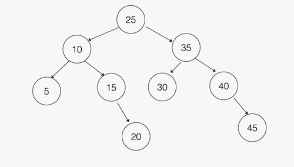

# Array-to-BST

## Problem Statment

Given a sorted array of integers, `arr`, write a function to create a balanced Binary Search Tree from the contents of the array. Return the root of the Binary Search Tree.

Example:

`arr = [5, 10, 15, 20, 25, 30, 35, 40, 45]`

should result in a tree with the following root/height:



Please note one is not required to implement a self-balancing Binary Search Tree in order to solve this exercise. 

It is recommended to break the problem down recursively by first setting the root of the Binary Search Tree to the middle element of the array.

## Prompts

<!-- Question 1 -->
<!-- prettier-ignore-start -->
### !challenge
* type: paragraph
* id: d0a2663c-8528-41b6-8e21-333812b18876
* title: Ask Clarifying Questions
* topics: pse
##### !question

List three or more questions whose answers would clarify the problem statement

##### !end-question

##### !explanation

Here are some example clarifying questions:

1. What kind of data is stored in the Tree Nodes?
2. Is the array guaranteed to be non-empty?

##### !end-explanation

### !end-challenge
<!-- prettier-ignore-end -->

<!-- Question 2 -->
<!-- prettier-ignore-start -->

### !challenge
* type: code-snippet
* language: python3.6
* id: 275e4d6e-accf-4dd3-89c4-9f23729615e8
* title: Write Unit Tests
* topics: pse
##### !question

1. Use the comments provided to write at least two example input/outputs:
    * Consider at least one nominal and one edge case.
    * What is the expected output for the given input?
    * You can use the examples provided in the prompt, or other examples.
2. Write unit tests for `arr_to_bst` for the nominal and edge cases you identified in the first step.

*Note: Click the **Run Tests** button to save your tests for instructor feedback. No real tests are actually run again your unit tests.*

##### !end-question
##### !placeholder

```py
# example input 1:
# expected output 1:

# example input 2:
# expected output 2:

def test_nominal_case():
    # ^rename with meaningful test name
    # and complete test implementation below
    pass
    # arrange

    # act

    # assert

def test_edge_case():
    # ^rename with meaningful test name
    # and complete test implementation below
    pass
    
    # arrange
    
    # act
    
    # assert
```
##### !end-placeholder

##### !tests

```py
import unittest

class TestPython1(unittest.TestCase):
  def test_always_pass(self):
    self.assertEqual(1,1)
```

##### !end-tests
##### !explanation 

Example tests:

```python
def test_will_return_balanced_bst_for_odd_lengthed_list(self):
        # Arrange
        arr = [5, 10, 15, 20, 25, 30, 35, 40, 45]

        # Act
        result = arr_to_bst(arr)

        # Assert
        self.assertEqual(result.val, 25)
        self.assertTrue(is_bst(result))
        self.assertTrue(is_balanced_tree(result))

def test_will_return_none_for_empty_list(self):
        # Arrange
        arr = []

        # Act
        result = arr_to_bst(arr)

        # Assert
        self.assertEqual(result, None)
```

##### !end-explanation
### !end-challenge
<!-- prettier-ignore-end -->

<!-- Question 3 -->
<!-- prettier-ignore-start -->
### !challenge
* type: paragraph
* id: eeadcbbb-7fda-4fac-8ef2-309bf97d7245
* title: Create Logical Steps
* topics: pse
##### !question

Without writing code, describe how you would implement `arr_to_bst` in enough detail that someone else could write the code. 
* It may be helpful to break up the problem/algorithm into smaller subproblems/algorithms. For example, 1. Handle invalid input, 2. Given valid input, perform the computation/solve the problem/etc.
* Your logical steps could take the form of a numbered list, pseudo code, or anywhere in between. What's important at this stage is to think through and outline the implementation before writing code.

##### !end-question

##### !placeholder

Write the logical steps here.

##### !end-placeholder

### !end-challenge
<!-- prettier-ignore-end -->
