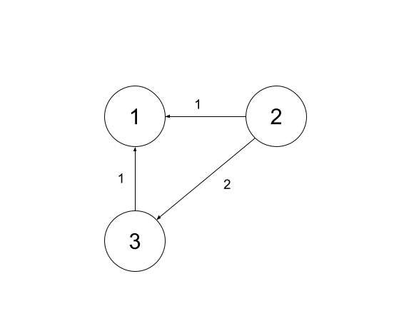

# Implement Network Delay Time

<!-- prettier-ignore-start -->
### !challenge
* type: code-snippet
* language: python3.6
* id: 029a5285-6422-4acf-a71b-d4ee862a59ec
* title: Network Delay Time
* points: 3
### !question
For this exercise, create a function `network_delay_time` which accepts the following parameters:
- A list of travel times, `times`. Each element of `times` represents a directed edge `times[i] = (uᵢ, vᵢ, wᵢ)` where:
    - `uᵢ` is the source node
    - `vᵢ` is the target node 
    - `wᵢ` is the time it takes for a signal to travel from the source node to the target node
- The total number of nodes in the graph, `n`
- The node from which a signal is being sent, `source`

The nodes in the graph are labeled from `1` to `n`.

Return the **minimum** time it takes for **all** of the nodes in the graph to receive the signal from the `source` node. If it is not possible for all of the nodes to receive the signal, return `-1`.

### Example 1


```py
Inputs: times = [[2,1,1], [2,3,1], [3,4,1]], n = 4, source = 2 

Output: 2
```

**Explanation:** Starting from node 2: it takes 1 unit of time to reach node 1, 1 unit of 
time to reach node 3, and 2 units of time to reach node 4 (1 unit of time from 
2 -> 3 and 1 unit of time from 3 -> 4 so 2 units overall). 

Therefore, to reach all of the nodes, it would take a minimum of 2 units of time. 

### Example 2

  

```py
Inputs: times = [[2,1,1], [2, 3, 2], [3, 1, 1]], n = 3, source = 1

Output: -1
```

**Explanation:** It is not possible to reach any other node from node 1, so the function would 
return -1 to indicate it is not possible to reach all of the nodes in the graph
from the given source node.

### Example 3


```py
Input: times = [[2, 3, 2]], n = 3, source = 2

Output: -1
```

**Explanation:** It is not possible to reach all of the nodes in the graph due to the graph being 
disconnected, so the function would return -1 to indicate it is not possible to 
reach all of the nodes in the graph from the given source node.
### !end-question
### !placeholder

```python
def network_delay_time(times, n, source):
    """
    A function which takes in a list of edges representing a graph of network nodes
    and the time to travel between the nodes, the number of nodes in the network
    graph, and a source node. 

    The function returns the minimum amount of time to travel to all of the nodes in
    the graph from the source node.
  
    Parameters:
    times (List[List[int]]): List of edges representing the time to travel between nodes in the graph.
    n (int): The total number of nodes in the network graph
    source (int): The source node from which to travel the network
  
    Returns:
    Int: The minimum amount of time to travel to all of the nodes in the graph.
    """
    pass
```

### !end-placeholder
### !tests
```python
import unittest
from main import *

class TestChallenge(unittest.TestCase):
    def test_network_delay_returns_correct_result_for_small_connected_graph(self):
        # Arrange
        times = [
            [2,1,1],
            [2,3,1],
            [3,4,1]
        ]
        n = 4
        source = 2

        # Act
        result = network_delay_time(times, n, source)

        # Assert
        self.assertEqual(result, 2)

    def test_network_delay_returns_minus_1_when_node_unreachable(self):
        # Arrange
        times = [
            [2,1,1],
            [2,3,2],
            [3,1,1]
        ]
        n = 3
        source = 1

        # Act
        result = network_delay_time(times, n, source)

        # Assert
        self.assertEqual(result, -1)

    def test_network_delay_returns_minus_1_for_disconnected_graph(self):
        # Arrange
        times = [
            [2,3,2]
        ]
        n = 3
        source = 2

        # Act
        result = network_delay_time(times, n, source)

        # Assert
        self.assertEqual(result, -1)

    def test_network_delay_returns_correct_result_for_larger_graph(self):
        # Arrange
        times = [
            [1, 2, 3],
            [2, 4, 1],
            [2, 5, 5],
            [2, 3, 6],
            [3, 5, 6],
            [4, 5, 7]
        ]
        n = 5
        source = 1

        # Act
        result = network_delay_time(times, n, source)

        # Assert
        self.assertEqual(result, 9)
```
### !end-tests
### !explanation

An example of a working implementation:

```python
import collections
from heapq import heappush, heappop
def network_delay_time(times, n, source):
    # Initialize dictionary with default value as a list
    # More information about defaultdict can be found in the documentation for Python: https://docs.python.org/3/library/collections.html#collections.defaultdict
    graph = collections.defaultdict(list)
    # For each edge in the graph, add the neighbors for a node to the graph
    # such that graph[node] = [(neighbor1, time1), (neighbor2, time2)...]
    # The graph is directed, so we only need to append one direction
    for u, v, time in times:
        graph[u].append((v, time))

    # initialize the time needed to reach each node in the graph, overestimating to infinity
    time_needed = [float('inf')] * n
    # set the time to reach the source node to 0
    time_needed[source-1] = 0
    # initialize min heap for traversal
    # priority 0 to travel to the source node
    heap = [(0, source)] 

    visited = set() # used to record all visited nodes

    # while there are nodes in the heap
    while heap:
        # pop off the closest node
        time, curr_node = heappop(heap)
        # if the current node has already been visited, continue
        if curr_node in visited:
            continue
        # add the current node to the list of visited nodes
        visited.add(curr_node)
        # traverse through the current node's neighbors
        for neighbor, neighbor_time in graph[curr_node]:
            # if the neighbor has already been visited, continue
            if neighbor in visited:
                continue
            # calculate the total time to travel to the neighbor
            total_time = time + neighbor_time
            # if the total time is less than the previous time stored to travel to the neighbor
            if total_time < time_needed[neighbor - 1]:
                # store the total time as the time needed to travel to the neighbor
                time_needed[neighbor - 1] = total_time
                # push onto heap to be visited later
                heappush(heap, (total_time, neighbor))

    # return the max time in time_needed list if all of the nodes have been visited, otherwise return -1
    return max(time_needed) if len(visited) == n else -1
```
### !end-explanation

### !end-challenge
<!-- prettier-ignore-end -->

<details style="max-width: 700px; margin: auto;">
<summary>Click here to see the tests that will be run against your code</summary>

```py
def test_network_delay_returns_correct_result_for_small_connected_graph():
    # Arrange
    times = [
        [2,1,1],
        [2,3,1],
        [3,4,1]
    ]
    n = 4
    source = 2

    # Act
    result = network_delay_time(times, n, source)

    # Assert
    assert result == 2

def test_network_delay_returns_minus_1_when_node_unreachable():
    # Arrange
    times = [
        [2,1,1],
        [2,3,2],
        [3,1,1]
    ]
    n = 3
    source = 1

    # Act
    result = network_delay_time(times, n, source)

    # Assert
    assert result == -1

def test_network_delay_returns_minus_1_for_disconnected_graph():
    # Arrange
    times = [
        [2,3,2]
    ]
    n = 3
    source = 2

    # Act
    result = network_delay_time(times, n, source)

    # Assert
    assert result == -1

def test_network_delay_returns_correct_result_for_larger_graph():
    # Arrange
    times = [
        [1, 2, 3],
        [2, 4, 1],
        [2, 5, 5],
        [2, 3, 6],
        [3, 5, 6],
        [4, 5, 7]
    ]
    n = 5
    source = 1

    # Act
    result = network_delay_time(times, n, source)

    # Assert
    assert result == 9
```

</details>

<!-- >>>>>>>>>>>>>>>>>>>>>> BEGIN CHALLENGE >>>>>>>>>>>>>>>>>>>>>> -->
<!-- Replace everything in square brackets [] and remove brackets  -->

### !challenge

* type: paragraph
* id: 5d1ff7ab-da11-4d64-95a9-3b07c55a9b2c
* title: Time Complexity of Solution
* points: 1

##### !question

What is the time complexity of your solution? Please define and explain your variables.

##### !end-question

##### !placeholder

##### !end-placeholder

##### !hint
Check the next hint for some points to keep in mind that might impact the time complexity of the sample implementation.
##### !end-hint

##### !hint
The sample implementation is based on Dijkstra's algorithm, so that will be a major driver of the time complexity. Additionally, we first translate from the edge list representation to an adjacency dict representation. And finally, we need to find the maximum delay time in the list of times for each node.

The next hint presents a discussion of the time complexity of the sample solution.
##### !end-hint

##### !hint
Converting the edge list to an adjacency dict requires that we iterate over each of the edges in the list. Adding each entry is constant time (both to make the initial node entry with an empty list, and for adding each edge to the list of edges for the node). This is O(E) time, where E is the number of edges in the graph.

In preparing to run Dijkstra's algorithm, we set up a list to hold the delay times. This is O(N) time, where N is the number of nodes in the graph, since it take O(N) time to initialize a list of length N. The remaining setup is all constant time.

To actually run Dijkstra's algorithm, we can draw on the discussion from our readings. The loop over the priority queue (`heap`) may need to iterate as many as O(E) times, since a node may be in the queue multiple times if we find less expensive paths as we visit nodes. We don't know how many times the inner loop iterating over a node's neighbors will run for any particular node, but over all the iterations, it will have run O(E) times in total. We _do not_ multiply these two loops together, even though they are nested. For any single iteration of the outer loop, the inner loop runs an unknown number of times, and it will be inconsistent from node to node. We only multiply the inner and outer loop complexities together when the inner loop is guaranteed to run the same number of times for each iteration of the outer loop. Instead, we need to analyze this from the perspective of how many times the inner loop runs overall, across all iterations of the outer loop. (Note, this is technically what we do even when multiplying complexities, but the multiplication technique is a shortcut to help us count total iterations when we know the inner iterations will be the same for every outer iteration). This means that we can say that all of the code within the whole outer loop is going to run O(E) times, whether it's a part of the inner or outer loop.

All of the operations performed during the main loop of Dijkstra's algorithm are constant, except for the heap operations themselves. From the reading, these we know to be O(log E) both for pushing and popping values. This means that our main loop will be O(E) (the total number of iterations) times O(log E) the cost per iteration (we can preemptively drop the coefficient of 2 that accounts for both pushing and popping), for a total time complexity of O(E log E) for the main loop.

Finally, after calculating all the delays, we must locate the maximum value in the list. This is O(N) time, since we must iterate over the entire list to find the maximum.

Summing up all the parts, we have changing the representation O(E) + initializing data for Dijkstra O(N) + the main loop O(E log E) + finding the maximum O(N) for a total time complexity of O(E + 2N + E log E). While we can't drop the N term (since we don't know the relationship between N and E), we _can_ drop the solitary E term, since O(E log E) will dominate, as well as the coefficient on N, for a final complexity of O(N + E log E), which agrees with our general analysis of using Dijkstra's algorithm on an adjacency list or dictionary.

##### !end-hint

### !end-challenge

<!-- ======================= END CHALLENGE ======================= -->

<!-- >>>>>>>>>>>>>>>>>>>>>> BEGIN CHALLENGE >>>>>>>>>>>>>>>>>>>>>> -->
<!-- Replace everything in square brackets [] and remove brackets  -->

### !challenge

* type: paragraph
* id: ae994d0b-c54a-45e0-8793-9c0ceee33718
* title: Space Complexity of Solution
* points: 1 

##### !question

What is the space complexity of your solution? Please define and explain your variables.

##### !end-question

##### !placeholder

##### !end-placeholder

##### !hint
Check the next hint for some points to keep in mind that might impact the space complexity of the sample implementation.
##### !end-hint

##### !hint
The sample implementation is based on Dijkstra's algorithm, so that will be a major driver of the space complexity. Additionally, we first translate from the edge list representation to an adjacency dict representation, so we'll need to account for that as well.

The next hint presents a discussion of the space complexity of the sample solution.
##### !end-hint

##### !hint
We incur no complexity cost for any of the data passed in (the edge list or the other scalar values). The first thing we do that _does_ incur cost is convert the list of edges into an adjacency dict. This requires that we create a new dictionary, and then iterate over each of the edges in the list, adding each to the dictionary. This is O(E) space, where E is the number of edges in the graph. We may not know how many nodes we will represent in the dictionary, but under the ones we do know about, we will have at most E entries in total.

Note that due to our use of a `defaultdict`, even if not all the nodes have outgoing edges, it's possible, while our logic runs, that it will still attempt to lookup and iterate over the edges of such nodes. This would cause keys for those nodes to be added to the dictionary, even though they had no edge data. Thus, we _could_ say that as written, the size of the graph could eventually grow to O(E + N). We'll ignore this for the moment, as we could add an explicit `in` check to our logic to prevent this from happening, and regardless, we'll see this doesn't affect the space complexity in the end.

In preparing to run Dijkstra's algorithm, we set up a list to hold the delay times. This is O(N) space, where N is the number of nodes in the graph. The remaining setup is all constant space, though we will need to think about how the sizes of `heap` and `visited` grow over the course of the main logic.

While the main logic of Dijkstra's algorithm runs, we only add nodes to the visited list if they are not there already. This means that the size of `visited` will never grow larger than the number of nodes in the graph, N. `heap`, on the other hand, could grow to encompass essentially all the edges in the graph. This is because we may add a node to the heap multiple times, if we find a shorter path to it as we traverse the graph. This means that the heap could grow to O(E) space, where E is the number of edges in the graph. We can't say for sure that it will grow to this size, but we can say that it will never grow larger than this size. Thus, we can say that the heap will be O(E) space. As discussed in the reading, if the Python heap methods supported a `decrease_key` operation (which they do not), we could reduce the space complexity of the heap to O(N), since we would never have to add a node to the heap more than once.

This accounts for all of the space utilization, since finding the maximum at the end incurs no additional space costs. Summing up all the parts, we have changing the representation O(E) + initializing data for Dijkstra O(N) + the growth of `visited` O(N) + the growth of `heap` O(E) for a total time complexity of O(2E + 2N). Dropping coefficients leaves us with a final complexity of O(N + E), which agrees with our general space analysis for using Dijkstra's algorithm in the absence of `decrease_key`. Even without that caveat, our space complexity would still be O(N + E) since we do create a new dictionary to hold the adjacency list representation of the graph. Also notice that even had we considered the complexity of the graph to be O(N + E), the final complexity would still be O(N + E), since this would only have affected the coefficient on N, which we drop anyway!

##### !end-hint

### !end-challenge

<!-- ======================= END CHALLENGE ======================= -->
